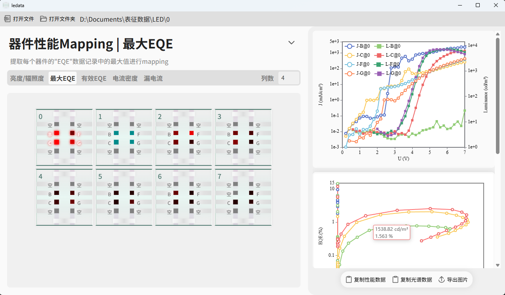

<h1 align="center">
  
   
  LEData
   
</h1>
<h3 align="center">基于<a href="https://github.com/tauri-apps/tauri">Tauri</a>开发的LED器件测试数据可视化浏览器
</h3>

⚠️开发者能力有限，仅针对性适配犀谱光电XPQY-EQE(LED测试设备)的下列测试控制客户端保存的LED器件性能数据文件⚠️
- LED Mesurement System V3.3.3
- XP-EQE1.1 (包是上面那个工程师离职了才有的重做的这个)

## 下载安装
请到发布页下载安装包：[Release page](https://github.com/prcxhy/ledata/releases) 

## 预览

## 功能
- LED器件测试数据交互式可视化
  - 器件性能概览Mapping (Mapping到器件点颜色上，越红值越大)，支持以下模式：
    - **最大亮度/辐照度**
    - **最大EQE**
    - **最大有效EQE** - 排除亮度小于该器件最大亮度10%的点后, 剩余EQE数据中的最大值
    - **最大电流密度**
    - **平均漏电流** (⚠️可能不准⚠️)
  - 器件性能曲线 (**电流密度-电压、亮度/辐照度-电压、EQE-亮度/辐照度**) 交互式展示
  - 器件不同电压下发光**光谱数据**的交互式展示
- 数据导出
  - 复制器件**性能数据、光谱数据**到剪贴板：采用制表符分隔，**可直接粘贴**到 Origin 或 Excel
  - 图片一键导出 (⚠️仅供预览，勿代替正式科研绘图)

## Python / CLI 接口
与 GUI 使用**同一份 Rust 解析核心**（口径完全一致），供自动化脚本与 Agent 调用：
- 安装包内含 `py-interface\`（`ledata_py` 扩展）与 `cli\ledata-cli.exe`，使用方法见安装目录下对应 README；
- 开发者文档：[docs/ledata_py.md](./docs/ledata_py.md)；
- 摘要输出面向 Agent（默认不含原始数组），光谱支持按电压匹配提取（器件/玻片/目录粒度）。

## 桌面App使用提示
- 器件点数据展示筛选
  - 左键单击器件点: 添加/删除单个器件点的数据到对应曲线图展示
  - 左键单击器件玻片: 添加/删除整个玻片上器件点的数据到对应曲线图展示
- 器件性能概览Mapping的异常点排除 (个别过高过红数据导致其余整体Mapping过暗)
  - 右键单击器件点: 在Mapping时排除/包含单个器件点的数据，排除时器件点变为青色
  - 右键单击器件玻片: 在Mapping时排除/包含整个玻片上器件点的数据

## License
GPL-3.0 License. See [License here](./LICENSE) for details.
